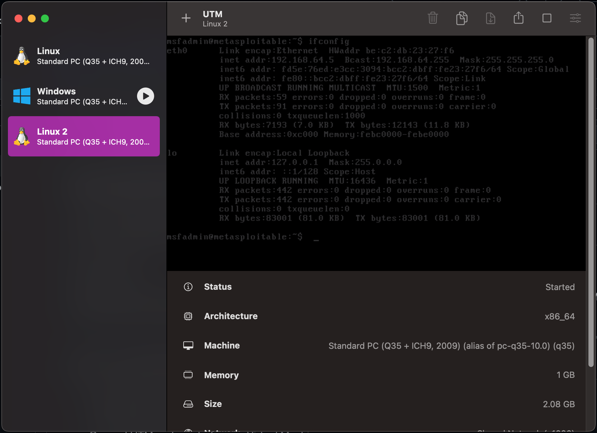

# Metasploit Level 01 - Introduction

## What is Penetration Testing?

Penetration testing means testing security by trying to break into a system legally.
It helps companies find weaknesses before real attackers find them.

## What is Metasploit?

Metasploit is a security testing framework used to:

- Test security
- Find vulnerabilities
- Practice ethical hacking
- Learn how attacks work

It is a tool used by penetration testers.

## Lab Setup

- Kali Linux → Attacker machine
- Metasploitable 2 → Vulnerable machine
- Metasploit Framework → Testing tool

---

