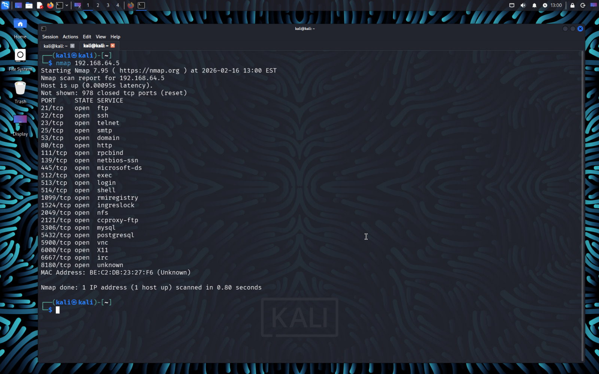
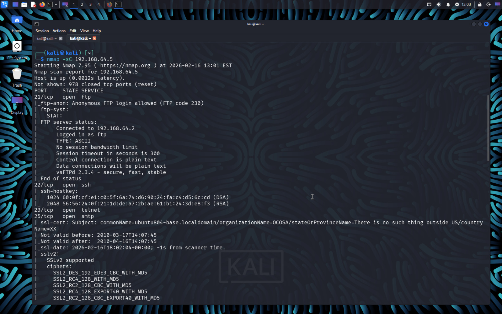
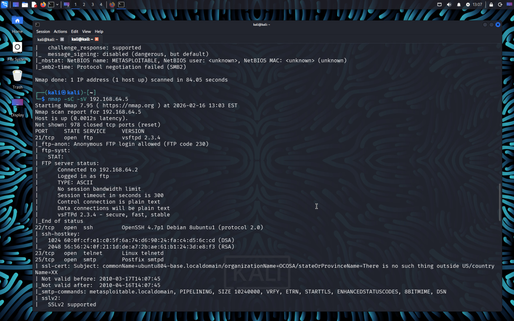

# Nmap Scanning & Service Detection

## Basic Scan
```
nmap 192.168.64.5
```


## Service Version Detection
```
nmap -sV 192.168.64.5
```


## Default Script Scan
```
nmap -sC -sV 192.168.64.5
```


## Understanding Output

PORT | STATE | SERVICE | VERSION
21/tcp | open | ftp | vsftpd 2.3.4

open → Service running
closed → No service
filtered → Blocked by firewall

If version shows vsftpd 2.3.4, system may be vulnerable.

---
